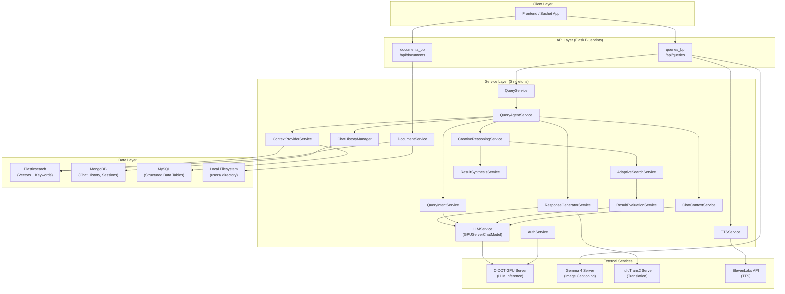
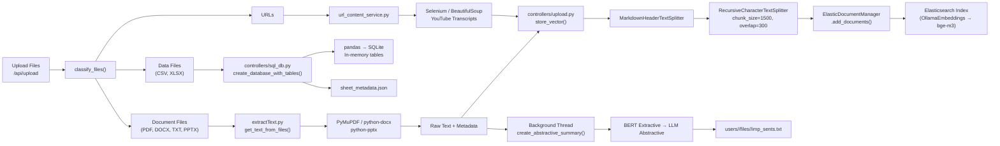
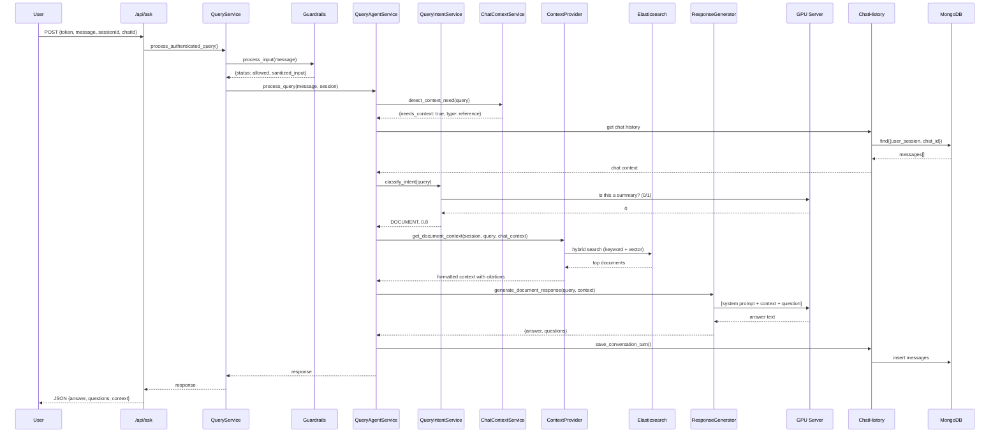
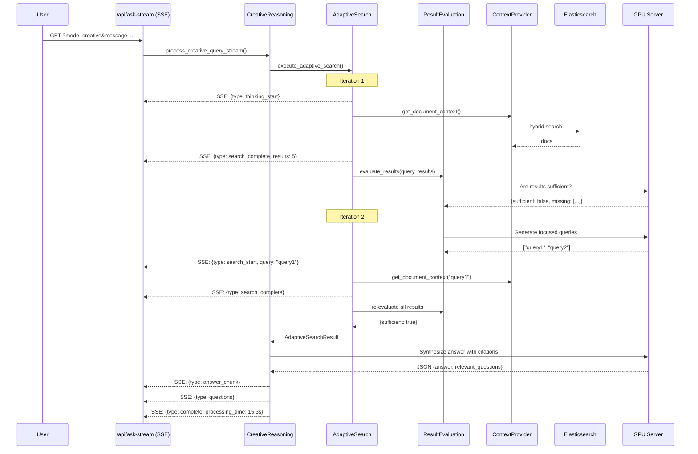
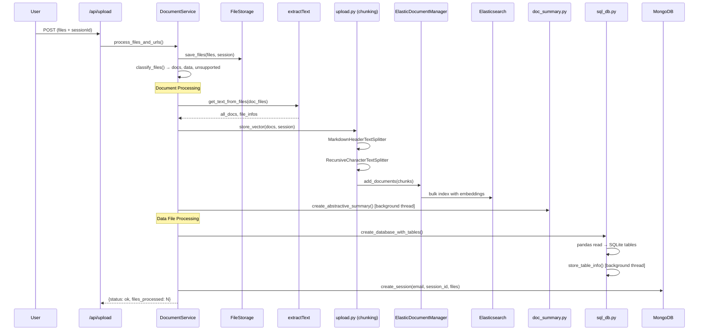

# Sachet Agent Backend — Complete Technical Documentation

> **Project**: sachet-agent-backend-main  
> **Purpose**: RAG (Retrieval-Augmented Generation) backend for C-DOT's Sachet integration  
> **Derived From**: Carnot Research's icarKno product  
> **Stack**: Python · Flask · Elasticsearch · MongoDB · LangChain · GPU-hosted LLMs

---

## Table of Contents

1. [Executive Summary](#1-executive-summary)
2. [Architecture Overview](#2-architecture-overview)
3. [Directory Structure & File Map](#3-directory-structure--file-map)
4. [Application Bootstrap](#4-application-bootstrap)
5. [Configuration & Environment](#5-configuration--environment)
6. [API Reference](#6-api-reference)
7. [Service Layer Deep Dive](#7-service-layer-deep-dive)
8. [RAG Pipeline](#8-rag-pipeline)
9. [Elasticsearch Integration](#9-elasticsearch-integration)
10. [Database Layer](#10-database-layer)
11. [Utilities](#11-utilities)
12. [Data Flow Diagrams](#12-data-flow-diagrams)
13. [Dependencies](#13-dependencies)
14. [Developer Onboarding Checklist](#14-developer-onboarding-checklist)

---

## 1. Executive Summary

This backend powers a **document-based Q&A system** where users:

1. **Upload** documents (PDF, DOCX, TXT, PPTX) and structured data (CSV, XLSX), or provide URLs
2. **Ask questions** — the system retrieves relevant chunks via hybrid search (keyword + vector) from Elasticsearch
3. **Get answers** — an LLM synthesizes retrieved context into cited, structured responses
4. **Manage sessions** — users organize documents into "knowledge containers" with full chat history

The system supports **23 Indian languages** via IndicTrans2 translation, **two query modes** (Standard and Creative/Adaptive Search), **text-to-speech** via ElevenLabs, and **image captioning** via Gemma 4.

---

## 2. Architecture Overview



### Key Architectural Patterns

| Pattern | Implementation |
|---------|---------------|
| **Flask Factory** | [app/\_\_init\_\_.py](file:///Users/richardrozario/Desktop/C-DOT/Sachet/sachet-agent-backend-main/app/__init__.py) — `create_app()` |
| **Blueprints** | `queries_bp` and `documents_bp` registered under `/api/` |
| **Singleton Services** | Every service uses `_instance = None` + `get_*_service()` factory |
| **Service-Oriented** | Controllers → Services → Data Access (no direct DB calls from routes) |
| **Hybrid RAG** | Keyword search + Vector search via `EnsembleRetriever` |
| **Streaming SSE** | Creative mode uses `text/event-stream` for real-time progress |

---

## 3. Directory Structure & File Map

```
sachet-agent-backend-main/
├── run.py                          # Entry point — creates app and runs on port 5000
├── requirements.txt                # Python dependencies
├── .env                            # Environment variables (not committed)
│
├── app/
│   ├── __init__.py                 # Flask factory: create_app()
│   ├── config.py                   # Config classes (Dev/Test/Prod) from .env
│   ├── extensions.py               # Flask extensions (Limiter)
│   │
│   ├── api/
│   │   ├── __init__.py             # Blueprint registration
│   │   ├── queries.py              # Query/Chat/Notes/TTS API routes (~1050 lines)
│   │   └── documents.py            # Upload/Container management routes (~360 lines)
│   │
│   ├── services/
│   │   ├── auth_service.py         # JWT authentication
│   │   ├── query_service.py        # Request validation + guardrails gateway
│   │   ├── query_agent_service.py  # Core orchestrator — routes to Standard or Creative
│   │   ├── query_intent_service.py # LLM-based intent classification (5 intents)
│   │   ├── context_provider_service.py  # Retrieves context from ES, SQL, summaries
│   │   ├── response_generator_service.py # Prompt engineering + LLM invocation
│   │   ├── creative_reasoning_service.py # Adaptive search + synthesis pipeline
│   │   ├── adaptive_search_service.py    # Iterative search with evaluation
│   │   ├── result_evaluation_service.py  # LLM evaluates search result sufficiency
│   │   ├── result_synthesis_service.py   # Multi-source answer synthesis
│   │   ├── chat_context_service.py       # Detects when chat history is needed
│   │   ├── chat_history_manager.py       # MongoDB CRUD for chat sessions
│   │   ├── document_service.py           # File classification + processing orchestrator
│   │   ├── llm_service.py               # GPUServerChatModel (LangChain wrapper)
│   │   ├── tts_service.py               # ElevenLabs text-to-speech
│   │   ├── url_content_service.py        # Web scraping + YouTube transcripts
│   │   ├── file_storage_service.py       # Local file storage management
│   │   ├── reasoning_strategy_service.py # Search strategy planning
│   │   └── search_execution_service.py   # Search execution orchestrator
│   │
│   └── models/
│       └── chat_models.py          # ChatSession, ChatMessage, ChatNames dataclasses
│
├── controllers/
│   ├── upload.py                   # Text chunking + vector storage
│   ├── ask.py                      # Legacy simple query handler
│   ├── database.py                 # MongoDB session CRUD operations
│   ├── delete_session.py           # Container deletion (ES index + files)
│   ├── doc_summary.py              # Abstractive + extractive summarization
│   └── sql_db.py                   # CSV/XLSX → SQLite + LLM-generated SQL queries
│
├── elastic/
│   ├── client.py                   # Elasticsearch connection singleton
│   ├── document_manager.py         # ElasticDocumentManager (add/update/delete docs)
│   ├── index_manager.py            # ElasticIndexManager (create/delete/check indices)
│   └── retriever.py                # ElasticRetriever (hybrid search: keyword + vector)
│
├── utils/
│   ├── extractText.py              # Multi-format text extraction (PDF, DOCX, PPTX, TXT)
│   ├── guardrails.py               # Input sanitization (prompt injection, PII, XSS)
│   └── translation.py             # IndicTrans2 integration for 22 Indian languages
│
└── users/                          # Runtime directory for user files + metadata
    └── <user_session>/
        ├── files/
        │   ├── <filename>/
        │   │   ├── content.txt     # Extracted text
        │   │   ├── metadata.json   # File metadata
        │   │   └── imp_sents.txt   # Extractive summary sentences
        │   └── sheet_metadata.json # CSV/XLSX table metadata
        ├── content.txt             # Legacy combined content
        └── prev_question.txt       # Last question (for context)
```

---

## 4. Application Bootstrap

### Entry Point: [run.py](file:///Users/richardrozario/Desktop/C-DOT/Sachet/sachet-agent-backend-main/run.py)

```python
from app import create_app
app = create_app("development")
app.run(host='0.0.0.0', port=5000, debug=True)
```

### Factory: [app/\_\_init\_\_.py](file:///Users/richardrozario/Desktop/C-DOT/Sachet/sachet-agent-backend-main/app/__init__.py)

The `create_app()` function:
1. Loads configuration via `ConfigFactory.get_config(config_name)`
2. Enables CORS (all origins — `"*"`)
3. Registers extensions (Flask-Limiter for rate limiting)
4. Registers blueprints (`queries_bp` at `/api/`, `documents_bp` at `/api/`)
5. Registers error handlers (400, 401, 403, 404, 429, 500)

### Blueprint Registration: [app/api/\_\_init\_\_.py](file:///Users/richardrozario/Desktop/C-DOT/Sachet/sachet-agent-backend-main/app/api/__init__.py)

```python
app.register_blueprint(queries_bp, url_prefix='/api')
app.register_blueprint(documents_bp, url_prefix='/api')
```

---

## 5. Configuration & Environment

### Config Classes: [app/config.py](file:///Users/richardrozario/Desktop/C-DOT/Sachet/sachet-agent-backend-main/app/config.py)

| Variable | Purpose | Default |
|----------|---------|---------|
| `ES_BASE_URL` | Elasticsearch endpoint | `http://localhost:9200` |
| `MONGO_URL` | MongoDB connection string | *required* |
| `MYSQL_HOST/USERNAME/PASSWORD/PORT` | MySQL for structured data | *required* |
| `OLLAMA_BASE_URL` | Ollama server (commented out, replaced by GPU server) | — |
| `OLLAMA_EMBEDDING_MODEL` | Embedding model name | `bge-m3:latest` |
| `OLLAMA_LLM_MODEL` | LLM model name (legacy) | `qwen2.5:7b` |
| `GPU_SERVER_BASE_URL` | C-DOT GPU server URL | *required* |
| `GPU_SERVER_API_KEY` | GPU server auth key | *required* |
| `GPU_SERVER_MODEL` | Model identifier on GPU server | *required* |
| `GPU_SERVER_DEFAULT_MAX_TOKENS` | Default token limit | *required* |
| `GPU_SERVER_VERIFY_SSL` | SSL verification toggle | `false` |
| `ELEVENLABS_API_KEY` | TTS API key | *required* |
| `BASE_USERS_DIR` | Base directory for user files | *required* |
| `JWT_SECRET_KEY` | JWT signing secret | `secret` |
| `SUMMARY_*` | Summary generation tuning params | varied |

### Validation

`BaseConfig.validate()` checks for required env vars at startup. Missing any of `ELEVENLABS_API_KEY`, `MONGO_URL`, `MYSQL_HOST`, `MYSQL_USERNAME`, `MYSQL_PASSWORD`, `OLLAMA_BASE_URL` raises `EnvironmentError`.

---

## 6. API Reference

### 6.1 Query Endpoints ([queries.py](file:///Users/richardrozario/Desktop/C-DOT/Sachet/sachet-agent-backend-main/app/api/queries.py))

#### Core Query

| Method | Endpoint | Auth | Description |
|--------|----------|------|-------------|
| `POST` | `/api/trialAsk` | Fingerprint | Trial user query (rate limited: 20/min) |
| `POST` | `/api/ask` | JWT | Authenticated user query (supports image upload) |
| `GET` | `/api/ask-stream` | JWT | SSE streaming for creative mode queries |
| `POST` | `/api/ask-tts` | JWT | Query + TTS audio streaming response (10/min) |
| `GET` | `/api/tts-health` | JWT | TTS service health check |
| `POST` | `/api/demo` | None | Demo endpoint for public transport queries |

#### Chat History

| Method | Endpoint | Auth | Description |
|--------|----------|------|-------------|
| `GET` | `/api/chat-history` | JWT | Get messages for a specific chat (paginated, max 100) |
| `GET` | `/api/chat-history/list` | JWT | List all chats in a session |
| `PUT` | `/api/chat-history/rename` | JWT | Rename a chat |
| `GET` | `/api/chat-history/stats` | JWT | Get chat statistics |
| `DELETE` | `/api/chat-history/clear` | JWT | Delete a specific chat |
| `DELETE` | `/api/chat-history/clear-all` | JWT | Delete all chats in a session |

#### Notes

| Method | Endpoint | Auth | Description |
|--------|----------|------|-------------|
| `POST` | `/api/notes/toggle` | JWT | Toggle save-to-note on a message |
| `GET` | `/api/notes/list` | JWT | List all saved notes |

#### Debug/Dev

| Method | Endpoint | Auth | Description |
|--------|----------|------|-------------|
| `POST` | `/api/chat-context/analyze` | JWT | Analyze if query needs chat context |

---

### 6.2 Document Endpoints ([documents.py](file:///Users/richardrozario/Desktop/C-DOT/Sachet/sachet-agent-backend-main/app/api/documents.py))

| Method | Endpoint | Auth | Description |
|--------|----------|------|-------------|
| `POST` | `/api/freeTrial` | Fingerprint | Upload files + URLs for trial users |
| `POST` | `/api/upload` | JWT | Create new knowledge container with files + URLs |
| `POST` | `/api/add-upload` | JWT | Add files/URLs to existing container |
| `GET` | `/api/files/<session_id>/<filename>` | JWT | Download/view a specific uploaded file |
| `PUT` | `/api/timestamp` | JWT | Update container's last-accessed timestamp |
| `PUT` | `/api/rename-container` | JWT | Rename a knowledge container |
| `GET` | `/api/get-containers` | JWT (Bearer) | List all containers for current user |
| `DELETE` | `/api/delete-container` | JWT | Delete container + ES index + files |

---

### 6.3 Request/Response Formats

#### `/api/ask` — Standard Query

**Request** (JSON or multipart with image):
```json
{
    "token": "jwt_token",
    "message": "What are the key findings?",
    "context": true,
    "sessionId": "abc123",
    "chatId": "1716000000000",
    "inputLanguage": 23,
    "outputLanguage": 23,
    "filenames": ["report.pdf"],
    "hasCsvOrXlsx": false,
    "mode": "default"
}
```

**Response**:
```json
{
    "answer": "The key findings include... [report.pdf, Page 5]",
    "questions": ["What methodology was used?", "..."],
    "context": [
        {"index": 1, "text": "...", "source": "report.pdf", "page": "5"}
    ],
    "assistant_message_id": "msg_abc123",
    "chat_context_used": {
        "context_type": "reference",
        "confidence": 0.85,
        "messages_referenced": 3,
        "chat_id": "1716000000000"
    }
}
```

#### `/api/ask-stream` — Creative Mode (SSE)

Events emitted (in order):
1. `thinking_start` — "Analyzing your question..."
2. `search_start` — Query + iteration info
3. `search_complete` — Results count
4. `analyzing` — "Evaluating search results..."
5. `synthesis_start` — "Creating comprehensive answer..."
6. `answer_chunk` — The final answer text
7. `questions` — Follow-up questions array
8. `complete` — Processing metadata (time, iterations, confidence)

---

## 7. Service Layer Deep Dive

### 7.1 QueryService ([query_service.py](file:///Users/richardrozario/Desktop/C-DOT/Sachet/sachet-agent-backend-main/app/services/query_service.py))

**Role**: Gateway between API routes and the query processing pipeline. Handles:
- Request parameter extraction and validation
- **Guardrails** processing (input sanitization via `GuardrailProcessor`)
- Trial vs authenticated query routing
- Demo mode queries
- Delegates to `QueryAgentService` for actual processing

### 7.2 QueryAgentService ([query_agent_service.py](file:///Users/richardrozario/Desktop/C-DOT/Sachet/sachet-agent-backend-main/app/services/query_agent_service.py))

**Role**: Core orchestrator — the brain of the query pipeline.

**Processing flow:**
```
process_query()
  ├── Check available resources (documents, tables, summaries)
  ├── Get chat context if needed (via ChatContextService)
  ├── Decide mode: Standard vs Creative
  │
  ├── STANDARD MODE:
  │   ├── Image query? → Force DOCUMENT intent
  │   ├── Classify intent (via QueryIntentService)
  │   │   ├── GENERAL_CHAT (+ docs available → document-aware chat)
  │   │   ├── SUMMARY → get_summary_context()
  │   │   ├── DOCUMENT → get_document_context() → generate_document_response()
  │   │   ├── DATA_QUERY → get_data_context() → generate_data_response()
  │   │   └── HYBRID → both contexts → generate_hybrid_response()
  │   └── Return response
  │
  ├── CREATIVE MODE:
  │   └── Delegate to CreativeReasoningService
  │
  └── Save conversation turn to MongoDB
```

**Creative mode guards:**
- Must be explicitly requested (`mode == 'creative'`)
- Service must be available
- Not for trial users
- Requires resources to exist
- Query must be ≥3 words

### 7.3 QueryIntentService ([query_intent_service.py](file:///Users/richardrozario/Desktop/C-DOT/Sachet/sachet-agent-backend-main/app/services/query_intent_service.py))

**Role**: Classifies user queries into 5 intents.

| Intent | Trigger | Confidence |
|--------|---------|------------|
| `GENERAL_CHAT` | Greetings, "how are you", etc. | 0.9 |
| `SUMMARY` | "Summarize this", "give me a summary" (LLM-classified) | 0.9 |
| `DATA_QUERY` | Numerical/tabular queries when CSV/XLSX present (LLM-classified) | 0.9 |
| `HYBRID` | Data query that also needs document context (LLM-classified) | 0.8 |
| `DOCUMENT` | Default when documents exist | 0.8 |

> [!NOTE]
> Summary and data classifications use the LLM (`get_fast_llm()`) with binary prompts. Each call adds ~0.5-1s latency.

### 7.4 ContextProviderService ([context_provider_service.py](file:///Users/richardrozario/Desktop/C-DOT/Sachet/sachet-agent-backend-main/app/services/context_provider_service.py))

**Role**: Retrieves context from three sources:

1. **Document Context** (`get_document_context`)
   - Uses `ElasticRetriever` for hybrid search
   - Enhances queries with chat context (reference/clarification/continuation)
   - Augments results with **full table chunks** when partial table data is found
   - Limits: max 5 text chunks, max 15 total chunks (tables prioritized)
   - Returns numbered, formatted context with source citations

2. **Data Context** (`get_data_context`)
   - Delegates to `controllers/sql_db.py` → `query_database()`
   - LLM generates SQL from natural language → executes on SQLite

3. **Summary Context** (`get_summary_context`)
   - Delegates to `controllers/doc_summary.py` → `summarize_document()`
   - Uses extractive (BERT) + abstractive (LLM) summarization

### 7.5 ResponseGeneratorService ([response_generator_service.py](file:///Users/richardrozario/Desktop/C-DOT/Sachet/sachet-agent-backend-main/app/services/response_generator_service.py))

**Role**: Prompt engineering hub. Creates specialized prompts for each query type.

**Key design decisions:**
- All prompts enforce **strict grounding**: "Use ONLY information in the CONTEXT"
- No abbreviation expansion unless explicitly present in context
- Language instruction is always **"Answer in English ONLY"** — translation happens post-LLM via IndicTrans2
- Image descriptions are injected into document context when present
- Response parsing handles nested JSON, malformed JSON, and plain text fallbacks

### 7.6 CreativeReasoningService ([creative_reasoning_service.py](file:///Users/richardrozario/Desktop/C-DOT/Sachet/sachet-agent-backend-main/app/services/creative_reasoning_service.py))

**Role**: Advanced query processing with adaptive iterative search.

**Pipeline:**
```
process_creative_query_stream()
  ├── Check resources exist
  ├── Execute adaptive search (yields streaming events)
  │   ├── Initial search with enhanced query
  │   ├── Evaluate results (LLM-based)
  │   ├── Loop up to 3 iterations:
  │   │   ├── Generate focused queries for missing aspects
  │   │   ├── Execute focused searches
  │   │   ├── Re-evaluate combined results
  │   │   └── Break if sufficient
  │   └── Deduplicate and combine results
  ├── Synthesize final answer (LLM with citation instructions)
  ├── Parse JSON response (answer + relevant_questions)
  ├── Generate follow-up questions if none from synthesis
  └── Yield completion event with metadata
```

**Max processing time**: 120 seconds

### 7.7 AdaptiveSearchService ([adaptive_search_service.py](file:///Users/richardrozario/Desktop/C-DOT/Sachet/sachet-agent-backend-main/app/services/adaptive_search_service.py))

**Role**: Iterative search with feedback loop.

- **Max iterations**: 3
- **Min content threshold**: 500 characters
- **Deduplication**: Content fingerprinting (first 50 + last 50 chars of normalized text)
- **Search sources**: Documents → Data tables → Summaries (fallback)

### 7.8 ResultEvaluationService ([result_evaluation_service.py](file:///Users/richardrozario/Desktop/C-DOT/Sachet/sachet-agent-backend-main/app/services/result_evaluation_service.py))

**Role**: Determines if search results are sufficient.

- **Quick checks**: Empty results → 0.0, Content < 200 chars → 0.2
- **LLM evaluation**: Checks if results address the question, have sufficient detail
- **Adaptive threshold**: Lowers confidence requirement by 0.1 per iteration (min 0.5)
- **Fallback**: Heuristic based on content length + keyword overlap

### 7.9 ChatContextService ([chat_context_service.py](file:///Users/richardrozario/Desktop/C-DOT/Sachet/sachet-agent-backend-main/app/services/chat_context_service.py))

**Role**: Determines when and how to use chat history.

**Detection strategy (3-tier):**
1. **Pattern-based** (fast): Regex patterns for references ("you said"), clarifications ("explain more"), continuations ("also", "what else")
2. **LLM-based** (for borderline cases): Analyzes pronouns, references, context needs
3. **Combined**: Weighted average (70% pattern, 30% LLM)

**Context extraction strategies:**
| Type | Method | Window |
|------|--------|--------|
| `recent` | Last 2-3 conversation pairs | 6 messages |
| `reference` | Keyword overlap scoring | Last 20 messages |
| `clarification` | Last assistant response + preceding user query | 3 messages |
| `continuation` | Same as recent | 6 messages |

### 7.10 LLMService ([llm_service.py](file:///Users/richardrozario/Desktop/C-DOT/Sachet/sachet-agent-backend-main/app/services/llm_service.py))

**Role**: Centralized LLM abstraction via a custom LangChain-compatible `GPUServerChatModel`.

> [!IMPORTANT]
> The original Ollama integration is **completely commented out**. All LLM calls now go through the C-DOT GPU server using an OpenAI-compatible chat API at `/cdot/ollama2/api/chat`.

**LLM variants:**

| Function | max_tokens | temperature | Use Case |
|----------|-----------|-------------|----------|
| `get_fast_llm()` | 512 | 0.3 | Intent classification, evaluation |
| `get_standard_llm()` | default (from env) | 0.7 | Response generation |
| `get_comprehensive_llm()` | 2048 | 0.5 | Result synthesis |
| `get_creative_llm()` | 1500 | 0.9 | Creative reasoning |
| `get_code_llm()` | 2048 | 0.1 | SQL generation |

### 7.11 ChatHistoryManager ([chat_history_manager.py](file:///Users/richardrozario/Desktop/C-DOT/Sachet/sachet-agent-backend-main/app/services/chat_history_manager.py))

**Role**: Full CRUD for multi-chat MongoDB storage.

**MongoDB Collections:**
- `chat_sessions` — Stores all chat messages per user_session + chat_id
- `chat_names` — Stores chat display names, creation dates

**Key Operations:**
- `save_conversation_turn()` — Saves both user and assistant messages atomically
- `get_session_stats()` — Message counts per chat
- `list_chats()` — All chats with names and timestamps
- `toggle_message_note()` — Bookmark messages as notes
- `get_saved_notes()` — Retrieve all bookmarked messages
- Auto-generates chat names: "Chat - <DD Mon YYYY>"

---

## 8. RAG Pipeline

### 8.1 Document Ingestion



### 8.2 Chunking Strategy

Defined in [controllers/upload.py](file:///Users/richardrozario/Desktop/C-DOT/Sachet/sachet-agent-backend-main/controllers/upload.py):

1. **Stage 1 — Markdown Header Splitting**: Splits on `#`, `##`, `###` headers to respect document structure
2. **Stage 2 — Recursive Character Splitting**: Further splits large chunks with:
   - `chunk_size = 1500` characters
   - `chunk_overlap = 300` characters
   - Separators: `\n\n`, `\n`, `. `, ` `, `""`

Each chunk gets metadata: `source`, `filename`, `page`, `content_type` (text/table), `table_id`

### 8.3 Embedding

- **Model**: `bge-m3:latest` via `OllamaEmbeddings`
- **Endpoint**: Configured via `OLLAMA_BASE_URL` in `.env`
- **Storage**: Elasticsearch with `ElasticsearchStore` from LangChain

### 8.4 Retrieval (Hybrid Search)

Defined in [elastic/retriever.py](file:///Users/richardrozario/Desktop/C-DOT/Sachet/sachet-agent-backend-main/elastic/retriever.py):

```
ElasticRetriever.search()
  ├── Vector Retriever (similarity_search, k=5)
  ├── Keyword Retriever (BM25-based, k=5)
  └── EnsembleRetriever (weights: [0.5, 0.5])
      └── Returns top documents ranked by combined score
```

**Special handling:**
- `get_full_table_chunks()` — When a table chunk appears in top-k, fetches ALL chunks for that table via metadata filter, bypassing top-k limits

---

## 9. Elasticsearch Integration

### 9.1 Client ([elastic/client.py](file:///Users/richardrozario/Desktop/C-DOT/Sachet/sachet-agent-backend-main/elastic/client.py))

- Singleton `Elasticsearch` client
- Connection via `ES_BASE_URL` from config
- SSL verification disabled (`verify_certs=False`)

### 9.2 Index Manager ([elastic/index_manager.py](file:///Users/richardrozario/Desktop/C-DOT/Sachet/sachet-agent-backend-main/elastic/index_manager.py))

- `create_index(index_name)` — Creates with standard settings
- `delete_index(index_name)` — Removes index entirely
- `index_exists(index_name)` — Boolean check
- Index naming: lowercase user_session string

### 9.3 Document Manager ([elastic/document_manager.py](file:///Users/richardrozario/Desktop/C-DOT/Sachet/sachet-agent-backend-main/elastic/document_manager.py))

- Uses `ElasticsearchStore.from_documents()` for batch ingestion
- `OllamaEmbeddings` with `bge-m3:latest` model
- `add_documents(docs, index_name)` — Stores or appends
- `delete_documents(index_name, filename)` — Removes by metadata filter

---

## 10. Database Layer

### 10.1 MongoDB — Chat & Session Management

**Connection**: Via `MONGO_URL` in config, database name: `sachet_agent`

| Collection | Purpose | Key Fields |
|-----------|---------|------------|
| `chat_sessions` | Chat messages | `user_session`, `chat_id`, `messages[]` |
| `chat_names` | Chat display names | `user_session`, `chat_id`, `chat_name`, `created_at` |

**Models** ([app/models/chat_models.py](file:///Users/richardrozario/Desktop/C-DOT/Sachet/sachet-agent-backend-main/app/models/chat_models.py)):
- `ChatMessage` — role, content, timestamp, message_id, query_type, save_to_note, metadata
- `ChatSession` — user_session, chat_id, messages[], created_at, updated_at, total_messages

### 10.2 MongoDB — Container Sessions

**Controller**: [controllers/database.py](file:///Users/richardrozario/Desktop/C-DOT/Sachet/sachet-agent-backend-main/controllers/database.py)

| Collection | Purpose |
|-----------|---------|
| `sessions` | Knowledge containers (email, session_id, files, name, created_at, updated_at) |

**Operations**: `create_session()`, `get_user_sessions()`, `delete_session_from_db()`, `rename_session()`, `update_session_timestamp()`, `add_files_to_session()`

### 10.3 MySQL — Structured Data Queries

**Controller**: [controllers/sql_db.py](file:///Users/richardrozario/Desktop/C-DOT/Sachet/sachet-agent-backend-main/controllers/sql_db.py)

- CSV/XLSX files are loaded into **SQLite in-memory databases** (not MySQL despite the config)
- LLM generates SQL from natural language using table schemas as context
- SQL is cleaned via `clean_sql_query()` (regex-based stripping of markdown, backticks)
- Results are formatted as markdown tables for LLM consumption

> [!WARNING]
> The MySQL config in `.env` exists but `controllers/sql_db.py` actually uses **SQLite via SQLAlchemy** (`create_engine("sqlite:///:memory:")`). MySQL may be intended for future use or for the parent Sachet app.

---

## 11. Utilities

### 11.1 Guardrails ([utils/guardrails.py](file:///Users/richardrozario/Desktop/C-DOT/Sachet/sachet-agent-backend-main/utils/guardrails.py))

`GuardrailProcessor` checks for:
- **Prompt injection**: System prompt override attempts, role-play requests
- **Harmful content**: Explicit harmful intents
- **PII**: Email, phone, SSN, credit card patterns
- **XSS/Code injection**: Script tags, SQL injection patterns

Returns `{"status": "allowed/blocked", "sanitized_input": "...", "flags": [...]}`

### 11.2 Translation ([utils/translation.py](file:///Users/richardrozario/Desktop/C-DOT/Sachet/sachet-agent-backend-main/utils/translation.py))

- Connects to an external **IndicTrans2** server
- `translate_to_indic(text, target_language)` — English → 22 Indian languages
- Language code mapping for all 22 scheduled languages + English
- Falls back to original text on failure

### 11.3 Text Extraction ([utils/extractText.py](file:///Users/richardrozario/Desktop/C-DOT/Sachet/sachet-agent-backend-main/utils/extractText.py))

Handles:
- **PDF**: `PyMuPDF` (fitz) — page-level extraction with page numbers
- **DOCX**: `python-docx` — paragraph extraction with table detection
- **PPTX**: `python-pptx` — slide-level extraction
- **TXT**: Direct file reading
- Saves extracted text + metadata to `users/<session>/files/<filename>/`

---

## 12. Data Flow Diagrams

### 12.1 Standard Query Flow



### 12.2 Creative Mode Flow



### 12.3 Document Upload Flow



---

## 13. Dependencies

### Core Framework
| Package | Version | Purpose |
|---------|---------|---------|
| Flask | 2.3.2 | Web framework |
| flask-cors | 6.0.0 | CORS handling |
| flask-limiter | 2.7.0 | Rate limiting |

### AI/ML
| Package | Version | Purpose |
|---------|---------|---------|
| langchain | 0.3.26 | LLM orchestration framework |
| langchain-core | 0.3.66 | Core abstractions |
| langchain-community | 0.3.16 | Community integrations |
| langchain-ollama | latest | Ollama embeddings |
| langchain-elasticsearch | 0.3.2 | ES vector store |
| bert-extractive-summarizer | 0.10.1 | Extractive summarization |
| torch | ≥2.1.0 | PyTorch for BERT |
| transformers | 4.47.1 | HuggingFace transformers |

### Document Processing
| Package | Version | Purpose |
|---------|---------|---------|
| PyMuPDF | latest | PDF text extraction |
| python-docx | 0.8.11 | DOCX processing |
| python-pptx | latest | PPTX processing |
| openpyxl | latest | Excel file handling |
| pandas | 2.2.3 | CSV/XLSX data manipulation |

### Database
| Package | Version | Purpose |
|---------|---------|---------|
| elasticsearch | ≥8.13.1 | Elasticsearch client |
| pymongo | 4.6.1 | MongoDB driver |
| sqlalchemy | 2.0.23 | SQL abstraction (SQLite) |

### Web Scraping
| Package | Version | Purpose |
|---------|---------|---------|
| selenium | 4.15.2 | Dynamic page scraping |
| beautifulsoup4 | 4.12.2 | HTML parsing |
| webdriver-manager | 4.0.1 | ChromeDriver management |

### Auth & Utilities
| Package | Version | Purpose |
|---------|---------|---------|
| PyJWT | 2.8.0 | JWT token handling |
| pydantic | 2.10.4 | Data validation |
| python-dotenv | 1.0.0 | Environment variable loading |
| IndicTransToolkit | latest | Indian language translation |

---

## 14. Developer Onboarding Checklist

### Prerequisites
- [ ] Python 3.10+ installed
- [ ] Access to C-DOT GPU server (URL + API key)
- [ ] Elasticsearch instance running
- [ ] MongoDB instance running
- [ ] ChromeDriver installed (for URL scraping)

### Setup Steps
1. **Clone the repo** and `cd sachet-agent-backend-main`
2. **Create virtual environment**: `python -m venv venv && source venv/bin/activate`
3. **Install dependencies**: `pip install -r requirements.txt`
4. **Configure `.env`** — Copy `.env.example` (if exists) and fill in:
   - `ES_BASE_URL`, `MONGO_URL`
   - `GPU_SERVER_BASE_URL`, `GPU_SERVER_API_KEY`, `GPU_SERVER_MODEL`, `GPU_SERVER_DEFAULT_MAX_TOKENS`
   - `OLLAMA_BASE_URL` (for embeddings only)
   - `ELEVENLABS_API_KEY` (for TTS)
   - `BASE_USERS_DIR` (path to `users/` directory)
   - `JWT_SECRET_KEY`, `MYSQL_*` credentials
5. **Run**: `python run.py` — starts on `http://0.0.0.0:5000`

### Key Things to Know

> [!IMPORTANT]
> **All services are singletons.** They're created on first access and reused. If you change service code, restart the server.

> [!WARNING]
> **The LLM service has switched from Ollama to GPU Server.** The Ollama code is commented out in `llm_service.py`. Embeddings still use Ollama (`OllamaEmbeddings`).

> [!TIP]
> **User sessions** are constructed as `email + sessionId.lower()`. This string is used as the Elasticsearch index name and the filesystem directory name under `users/`.

> [!CAUTION]
> **`controllers/sql_db.py` uses SQLite in-memory**, NOT MySQL. The MySQL config in `.env` may be for the parent Sachet app or future use. Data tables are ephemeral and lost on server restart.

### Common Debugging

| Issue | Where to Look |
|-------|---------------|
| No search results | Check ES index exists: `elastic/index_manager.py` → `index_exists()` |
| LLM not responding | Check GPU server URL and API key in `.env`, test with curl |
| Chat history missing | Check MongoDB connection: `MONGO_URL` in `.env` |
| File upload fails | Check `users/` directory permissions, `BASE_USERS_DIR` in `.env` |
| Translation not working | Check IndicTrans2 server is running, see `utils/translation.py` |
| Summary is empty | Check if `imp_sents.txt` was created in `users/<session>/files/<name>/` |

---

> **Document Version**: 1.0  
> **Last Updated**: May 2026  
> **Author**: Auto-generated from codebase analysis
